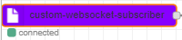
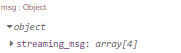
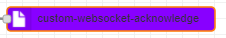
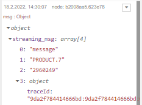

# node-red-contrib-ws-subscriber-custom
Custom Websocket for connecting to ESB with help of Header with Token and X-ClientId.

### Installation

```
npm install node-red-contrib-ws-subscriber-custom
```

Or in NodeRED Manage palette and serarch for `node-red-contrib-ws-subscriber-custom`

### Usage

#### custom-websocket-subsriber Node


Every subscriber node needs
* Websocket-Serveradress
* XClientId
* Token

If everything is correct the node shows a green dot after deploy. If the dot is red, something went wrong while connecting to the WSS.

Incoming messages gets append to the output message object with the name "streaming_msg".


#### custom-websocket-acknowledge


The acknowledge Node needs special format of Input Message (from custom-websocket-subscriber)
* the acknowledge Node sends messages back to the WSS configured in "custom-websocket-subsriber".
* This message is sended back to WSS to acknowledge:['message-ack', streaming_msg.message[1], streaming_msg.message[2]]

* Example: 
* Message send by WSS


* Message send to WSS by custom-websocket-acknowledge:
* ['message-ack', 'PRODUCT.7', '2960249']

